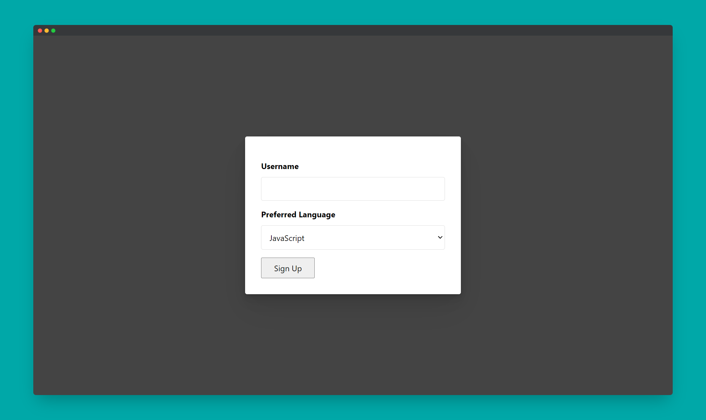

# Scrimba - Javascript Form Validator

This is a simple form validator checking input values with Vanilla Javascript.

## Table of contents

- [Overview](#overview)
  - [The challenge](#the-challenge)
  - [Screenshot](#screenshot)
  - [Links](#links)
- [My process](#my-process)
  - [Built with](#built-with)
- [Author](#author)
- [Acknowledgments](#acknowledgments)

## Overview

### The challenge

Users should be able to:

- Press the Sign Up button only if username is 1 to 5 characters long

### Screenshot

### Links

- Solution URL: [@GitHub](https://github.com/xdelmo/JS-form-validator)
- Live Site URL: [@GitHub](https://htmlpreview.github.io/?https://github.com/xdelmo/JS-form-validator/blob/master/index.html)

## My process

### Built with

- Semantic HTML5 markup
- CSS custom properties
- Flexbox
- Mobile-first workflow
- Vanilla Javascript

## Author

- Website - [Emanuele Del Monte](https://www.emanueledelmonte.it)

## Acknowledgments

A big thank you to [dcode](https://www.youtube.com/c/dcode-software)
